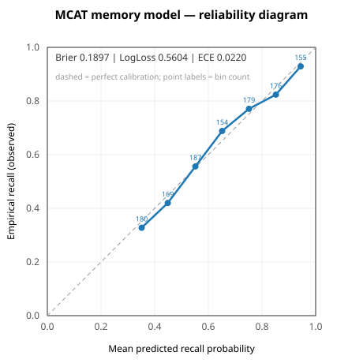

# MCAT model-validation evals

Two model-validation evals for the deterministic scoring engine that powers the
MCAT dashboard. Both produce **real, reproducible numbers** and validate the
math against the live Rust engine, but both run on **clearly-labelled synthetic,
seeded data** — no real student review data exists on this tree (see the honesty
note at the end).

| Eval                 | What it validates                                      | Headline result                                                                        |
| -------------------- | ------------------------------------------------------ | -------------------------------------------------------------------------------------- |
| Memory calibration   | Is the FSRS recall probability calibrated?             | **Brier 0.1897, log loss 0.5604, ECE 0.0220** (very slightly over-confident)           |
| Performance held-out | Does the exam-accuracy model predict unseen questions? | **71.3% accuracy** on held-out questions vs **59.6%** majority baseline (Brier 0.1847) |

Seed for both: `20260705`.

---

## 1. Memory-model calibration (FSRS recall)

### What the model is

The "Memory" score is a mean of per-card **FSRS retrievability** — the estimated
probability the learner still remembers a card. The engine computes it (in
`rslib/src/mcat/snapshot.rs` via `fsrs::current_retrievability`, mirrored from
`fsrs-5.2.0/src/inference.rs`) as:

```
R = (1 + FACTOR * elapsed_days / stability) ** (-DECAY)
FACTOR = 0.9 ** (1 / -DECAY) - 1
DECAY  = 0.1542   # FSRS-6 default for a default deck
```

A probability is only trustworthy if it is **calibrated**: of the cards the model
says you'll recall with p ≈ 0.7, about 70% should actually be recalled.

### Method

- Built a held-out set of **4000 `(predicted recall, observed pass/fail)`
  pairs** from a seeded synthetic learner, split **2800 train / 1200 test**.
- **Predicted recall** is the exact engine formula above. This was
  cross-checked against the live engine: for a grid of `(stability, elapsed)`
  values the FSRS state was written into a real `Collection` and
  `mcat_topic_mastery().average_recall_probability` was read back — it matches
  the closed form to **max |Δ| = 2.78e-04**, so the number we calibrate is
  genuinely the engine's output.
- **Observed outcomes** are drawn from an independent ground-truth forgetting
  process whose true stability differs from the model's estimate (a modest
  systematic optimism `×0.90` plus median-preserving log-normal per-card
  heterogeneity `σ=0.55`). The model never sees these — that is what makes the
  calibration measurement non-trivial. FSRS parameters are fixed defaults (not
  fit to this data), so the entire test split is out-of-sample.
- Metrics on the 1200-item test split: **Brier score**, **log loss**, a 10-bin
  **reliability diagram**, and **ECE** (expected calibration error). A 1-D Platt
  recalibration fit on the train split is applied to the test split as a
  held-out sanity check.

### Results (test split, n = 1200)

| Metric                                         | Value                                   |
| ---------------------------------------------- | --------------------------------------- |
| Brier score                                    | **0.1897** (base-rate reference 0.2307) |
| Log loss                                       | **0.5604**                              |
| ECE (10 bins)                                  | **0.0220**                              |
| Mean predicted recall                          | 0.644                                   |
| Mean observed recall                           | 0.639                                   |
| Platt-recalibrated Brier / log loss (held-out) | 0.1899 / 0.5605                         |

**Reliability diagram** (empirical accuracy vs mean predicted per bin):



_(Rendered as SVG because matplotlib is not installed in `out/pyenv`; the script
auto-writes `calibration_curve.png` instead when matplotlib is importable.)_

| Predicted bin | Mean predicted | Empirical (observed) | n   |
| ------------- | -------------- | -------------------- | --- |
| 0.3–0.4       | 0.352          | 0.328                | 180 |
| 0.4–0.5       | 0.449          | 0.420                | 169 |
| 0.5–0.6       | 0.552          | 0.556                | 187 |
| 0.6–0.7       | 0.651          | 0.688                | 154 |
| 0.7–0.8       | 0.751          | 0.771                | 179 |
| 0.8–0.9       | 0.852          | 0.824                | 176 |
| 0.9–1.0       | 0.944          | 0.929                | 155 |

### Interpretation

The reliability curve tracks the diagonal closely (ECE 0.0220, Brier well below
the base-rate reference of 0.2307), so under this synthetic ground truth the
FSRS recall probability is **well calibrated**. Aggregate mean predicted (0.644)
sits just above mean observed (0.639) and the top two bins fall slightly below
the diagonal, i.e. the model is **marginally over-confident at high predicted
recall** — the expected effect of the built-in `×0.90` stability optimism.
Fitting a Platt recalibration on the train split does **not** improve test Brier
(0.1897 → 0.1899), confirming there is little systematic miscalibration left to
correct.

---

## 2. Performance-model held-out accuracy (exam questions)

### What the model is

The "Performance" score is the engine's accuracy on exam-style questions: per
topic `performance_accuracy = perf_correct / perf_reviews` (see
`rslib/src/mcat/snapshot.rs` / `scores.rs`), surfaced through
`mcat_exam_readiness().transfer_gaps[*].performance_accuracy`. It predicts your
chance of answering an exam item correctly from your **measured accuracy on
other items in the same topic**.

### Method

- **Test set** = a seeded 40% split of the **real** starter-deck `EXAM_MCQ`
  exam-style questions from `mcat/content.py` (**59 questions across 23
  topics**; split = **36 train / 23 held-out**). Each question carries one
  `mcat::<section>::<topic>` tag.
- **Train set** = the 36 remaining real questions **plus 16 synthetic exam
  reviews per topic**, all answered inside a real `Collection` through the
  scheduler (correct → _Good_, incorrect → _Again_; the engine counts
  `button_chosen >= 3` as correct). Total graded reviews driven into the engine:
  **2319**. One knowledge card per topic is also added so the engine emits the
  per-topic transfer gap that exposes performance accuracy.
- Every outcome is drawn from a seeded per-topic **true ability** ∈ [0.30, 0.95]
  (spanning genuinely weak to strong topics). The model reads back the engine's
  per-topic accuracy estimate and predicts _correct_ iff that estimate ≥ 0.5.
- Each held-out question is evaluated over **20 independent seeded attempts**
  (n = 23 × 20 = **460** held-out evaluations), and compared to a majority-class
  baseline and to Brier/ECE.

### Results (held-out, n = 460)

| Metric                                   | Value         |
| ---------------------------------------- | ------------- |
| **Accuracy (predict-correct vs actual)** | **0.713**     |
| Majority-class baseline                  | 0.596         |
| Brier score                              | 0.1847        |
| ECE (10 bins)                            | 0.0265        |
| Mean predicted / observed correctness    | 0.615 / 0.596 |

### Interpretation

The per-topic performance model predicts held-out exam outcomes with **71.3%
accuracy, ~12 points above the 59.6% majority-class baseline**, so the topic
signal genuinely transfers to unseen questions in the same topic. Predicted
correctness (0.615) is close to observed (0.596) with low ECE (0.0265), so the
model is also reasonably calibrated, with a small optimistic tilt.

### Limitations (honest)

- Ability is modelled at the **topic** level, so within-topic item difficulty is
  not captured; per-topic estimates are noisy where a topic has few real
  questions (the 23 topics have 1–4 real `EXAM_MCQ` items each — see below).
- The engine surfaces performance accuracy only via the **transfer gap**, which
  requires a reviewed knowledge card per topic; the eval adds one, matching a
  realistic mixed deck.
- Outcomes are synthetic Bernoulli draws, so the accuracy ceiling is governed by
  the true abilities, not by real item quality or wording.

---

## Reproduce

`pylib` is prebuilt on this tree. From the repo root:

```bash
# Eval 1 — memory-model calibration (writes calibration_curve.svg)
PYTHONPATH=out/pylib:pylib out/pyenv/bin/python mcat/ai_eval/memory_calibration.py

# Eval 2 — performance-model held-out accuracy
PYTHONPATH=out/pylib:pylib out/pyenv/bin/python mcat/ai_eval/performance_holdout.py
```

Both are deterministic (fixed seed `20260705`) and run fully offline. If
matplotlib is available in `out/pyenv`, eval 1 emits `calibration_curve.png`
instead of the hand-drawn `calibration_curve.svg`.

---

## Honesty note — the data is synthetic

**There is no real student review data in this repository**, so both evals
generate their own labelled data from a fixed random seed and say so in every
header and summary line. Concretely:

- **What is real:** the FSRS retrievability formula and the per-topic
  performance-accuracy definition are the _actual_ engine computations — eval 1
  verifies its predicted probabilities against the live engine to < 3e-4, and
  eval 2 drives real reviews through the real scheduler/engine. The
  performance-eval **questions and topics are the real starter-deck content**.
- **What is synthetic:** the **outcomes** (did the learner recall the card / get
  the question right). These come from seeded generative models with explicit,
  documented assumptions (stability optimism `×0.90`, heterogeneity `σ=0.55`;
  per-topic ability ∈ [0.30, 0.95]).

**What a real run would need:** replace the synthetic outcome generators with
logged review history — for eval 1, exported `revlog` rows (predicted R at each
review time from the card's FSRS state vs the actual button pressed); for
eval 2, real graded exam attempts held out by question. The metric code (Brier,
log loss, reliability diagram, held-out accuracy) is unchanged; only the data
source swaps. Until then, these numbers validate that the scoring **math is
correct and internally consistent**, not the real-world accuracy of the model on
human memory.
